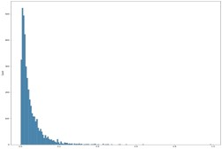

# 真实场景篡改图像检测挑战赛冠军方案（1/1149）

**“审稿人手下留情”队**

竞赛官网：https://tianchi.aliyun.com/competition/entrance/531945/rankingList/1

# 1. 篡改任务挑战解读

## 1.1 正负样本不均衡，模型优化困难
篡改问题，主要为二分语义分割问题，篡改任务主要是找出，擦除、替换、粘贴等篡改区域。通过分析已提供 4k 训练集，发现篡改区域（正）与非篡改区域（负）样本分布极度不均衡，存在长尾效应，如图 1 所示。因此需要克服样本不均衡问题，以修正模型优化方向

图 1. 训练集篡改区域占图片比例分布

## 1.2 正负样本视觉差异小，判别特征微弱
训练集中存在大量，粘贴与擦除样本，造成正负样本特征差异小。如图 2，粘贴区域字体（正）与其他字体（负）视觉差别较小；擦除区域（正）与其他无文字区域（负）视觉差别较小。并且擦除替换类篡改区域面积较小，导致正样本自身缺少丰富语义特征。因此需要克服正负样本视觉差异小，判别特征微弱问题，以修提升模型识别能力

图 2. 左图为粘贴篡改，右图为擦除篡改

## 1.3 训练集数据量小，泛化性弱
由于训练集只有 40k 监督样本，难以满足深度学习模型数据驱动训练模式，存在data-hungry 问题，具有过拟合的风险，泛化性受到影响。因此需要增加训练集样本数量，从数据方面增加样本多样性，提升深度模型泛化性能。

#  2. 解决方案

基于篡改任务中存在的三个挑战，我们设计以下思路：

- **针对数据集正负样本不均衡问题**，采用 lovasz-loss[1]，自动平衡训练过程中样本权重，保证对每张图片的正样本都有足够的学习能力。并且采用像素级 Online HardExample Mining(OHEM)[2]，自动过滤高置信度样本，针对困难且复杂的样本学习，进一步削弱正负样本不均衡问题。

- **针对正负样本视觉差异小，判别特征微弱问题**，采用大尺度输入与大尺度放缩数据增强策略，从微观和宏观层面分别增强特征差异。在微观层面上，对原始图像随机放大 1.0-3.0 倍，增强局部细节信息，使模型更加关注篡改区域中的异常样本（如擦除存在的残留，粘贴边缘的模糊效应等）；在宏观层面上，对放大后的图像随机裁剪768×768 与 1024×1024 的图像块，保证理论感受野足够大，使模型捕获大范围上下文信息，从而对比正负样本区域，提升其判别特征提取能力。

- **针对训练集数据量小，泛化性弱问题**，引入三种来源不同的数据集：

    1. 数据集 Sea3为安全 AI 挑战者计划第五期：伪造图像的篡改检测-长期赛训练集，2005 张；

    2. Ext 为自建数据集，通过爬取网图，自行标注，808 张；

    3. 伪标签数据集，通过多轮迭代，高置信度 A 榜测试集样本，4000 张。基于上述手段，将训练集扩充为原来 2.7 倍，极大提升了训练样本多样性。

  此外，考虑到计算资源受限与任务难易程度，采用渐进式学习方式。首先利用768×768 输入训练模型，然后利用 1024×1024 输入进行模型微调。同样在数据方面，先仅利用 40k 训练集进行模型训练，然后加入扩充样本进行模型微调。伪标签交叉监督CNN 和 Transformer 结构的网络，提升模型效果。

# 3. 实验细节

## 3.1 数据增强

首先对数据进行保持宽高比的多尺度放大，范围为 1.0-3.0，其次经过一系列的随机裁剪（先 768 后 1024）、随机水平翻转、随机垂直翻转、随机旋转 90°、颜色抖动、HSV 变换等操作。

## 3.2 模型选择

采用多种类型模型(CNN+Transformer)相融合的方式，提升不同表征形式对于不同特征的互补性。CNN 部分编码器采用目前 SOTA 的 ConvNeXt[3]模型，解码器采用金字塔结构UPerNet[4]；Transformer部分编码器采用目前SOTA的Swin-Transformer[5]模型，解码器采用 UPerNet。同时为了增加解码器差异性，还额外增加了 SegFormer[6]模型。三模型结果融合，获取高置信度伪标签，多轮迭代优化，提升模型的识别性能。

## 3.3 具体训练流程

| 模型          | 阶段 | 预训练   | 数据               | 尺寸      | 批次 | 步数 | 输出伪标签 |
| ------------- | ---- | -------- | ------------------ | --------- | ---- | ---- | ---------- |
| ConvNeXt-Base | 1    | ImageNet | 初始训练集         | 512×512   | 16   | 40k  | 无         |
|               | 2    | 阶段1    | 初始训练集         | 512×512   | 16   | 40k  | 无         |
|               | 3    | 阶段2    | 初始+Sea3          | 768×768   | 16   | 40k  | 无         |
|               | 4    | 阶段3    | 初始+Sea3          | 1024×1024 | 16   | 30k  | 无         |
|               | 5    | 阶段4    | 初始+Sea3          | 1024×1024 | 16   | 30k  | 无         |
|               | 6    | 阶段5    | 初始+Sea3+Ext      | 1024×1024 | 16   | 20k  | Pse1       |
|               | 7    | 阶段6    | 初始+Sea3+Ext+Pse1 | 1024×1024 | 16   | 20k  | Pse2       |
| Swin-Base     | 1    | ImageNet | 初始训练集         | 512×512   | 16   | 40k  | 无         |
|               | 2    | 阶段1    | 初始训练集         | 512×512   | 16   | 40k  | 无         |
|               | 3    | 阶段2    | 初始+Sea3          | 768×768   | 16   | 40k  | 无         |
|               | 4    | 阶段3    | 初始+Sea3          | 1024×1024 | 16   | 30k  | 无         |
|               | 5    | 阶段4    | 初始+Sea3          | 1024×1024 | 16   | 30k  | Pse1       |
|               | 6    | 阶段5    | 初始+Sea3+Ext+Pse1 | 1024×1024 | 16   | 20k  | 无         |
|               | 7    | 阶段6    | 初始+Sea3+Ext+Pse1 | 1024×1024 | 16   | 20k  | Pse2       |
|               | 8    | 阶段7    | 初始+Sea3+Ext+Pse2 | 1024×1024 | 16   | 20k  | 无         |
| SegFormer-B4  | 1    | ImageNet | 初始+Sea3          | 768×768   | 16   | 60k  | 无         |
|               | 2    | 阶段1    | 初始+Sea3          | 1024×1024 | 16   | 40k  | 无         |
|               | 3    | 阶段2    | 初始+Sea3+Ext+Pse1 | 1024×1024 | 16   | 30k  | 无         |

注：伪标签Pse1与Pse2为Swin与ConvNeXt融合结果

最终将三个模型的输出结果进行概率融合，得到最优精度。

# 4. 致谢

感谢主办方举办此次比赛，篡改任务具有特色挑战，启发研究与思考，并且需求紧贴实际应用。阿里天池给参与者提供了锻炼的平台，悉心解答大家的疑惑，让我们获取了大量宝贵的经验。希望将来也能够有机会继续参与此类竞赛，通过以赛代练，将研究成果面向应用转化。

此致，敬礼

"审稿人手下留情"团队

2022.03.25

# 5. 参考文献

1. Berman M, Triki AR, Blaschko MB. The Lov\’asz-Softmax loss: A tractable surrogate for the optimization of the intersection-over-union measure in neural networks. ArXiv170508790 Cs. 2018; Available from: http://arxiv.org/abs/1705.08790

2. He K, Gkioxari G, Dollár P, Girshick R. Mask R-CNN. ArXiv170306870 Cs. 2018; Available from: http://arxiv.org/abs/1703.06870

3. Liu Z, Mao H, Wu C-Y, Feichtenhofer C, Darrell T, Xie S. A ConvNet for the 2020s. ArXiv220103545 Cs. 2022; Available from: http://arxiv.org/abs/2201.03545

4. Xiao T, Liu Y, Zhou B, Jiang Y, Sun J. Unified Perceptual Parsing for Scene Understanding. ArXiv180710221 Cs. 2018; Available from: http://arxiv.org/abs/1807.10221

5. Liu Z, Lin Y, Cao Y, Hu H, Wei Y, Zhang Z, et al. Swin Transformer: Hierarchical Vision Transformer using Shifted Windows. ArXiv210314030 Cs. 2021; Available from: http://arxiv.org/abs/2103.14030

6. Xie E, Wang W, Yu Z, Anandkumar A, Alvarez JM, Luo P. SegFormer: Simple and Efficient Design for Semantic Segmentation with Transformers. ArXiv210515203 Cs. 2021; Available from: http://arxiv.org/abs/2105.15203
